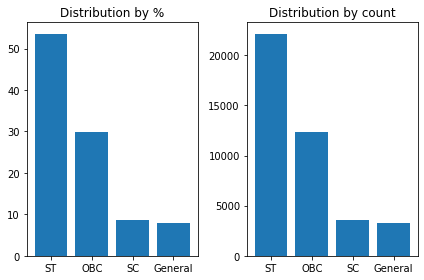
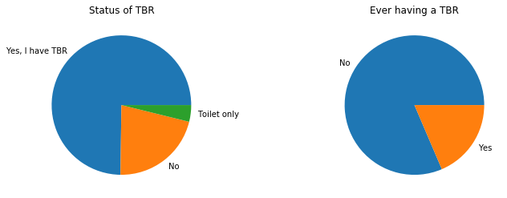
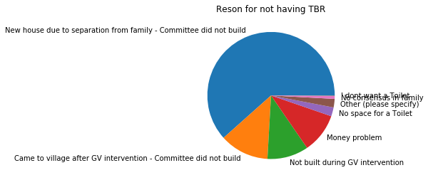

# Section 1 - Loading the Data File


```python
### import the libraries required
import pandas as pd
import string
import matplotlib.pyplot as plt
import numpy as np
```

## 1. Preparing the meta data


```python
###Define Categories of the Data

cat_type_gender_e = pd.CategoricalDtype(categories=["Male", "Female"], ordered=False)
cat_type_tf_e = pd.CategoricalDtype(categories=["TRUE", "FALSE"], ordered=False)
cat_type_T_F_e = pd.CategoricalDtype(categories=["TRUE", "FALSE"], ordered=False)
cat_type_yes_no_e = pd.CategoricalDtype(categories=["Yes", "No"], ordered=False)
cat_type_yes_no_h = pd.CategoricalDtype(categories=["हाँ", "नहीं"], ordered=False)
cat_type_eco_status = pd.CategoricalDtype(categories=["BPL", "APL"], ordered=False)
cat_type_sub_cat = pd.CategoricalDtype(categories=["OBC", 
                                                  "General",
                                                  "ST",
                                                  "SC"], ordered=False)
```


```python
###Define Data Type of the Columns 

col_types={"#":"float64",
"Deployment":"str",
"Enumerator":"str",
"Status":"str",
"Response Code":"str",
"Drafted On":"str",
"Submitted On":"str",
"Approval Level":"str",
"IP Address":"str",
"Take a photo of the house (1)":"str",
"Take a photo of the house (Not Applicable)":cat_type_tf_e,
"Basis for identifying this Household as a separate household":"str",
"Basis for identifying this Household as a separate household (Other (please specify)) - specify":"str",
"Basis for identifying this Household as a separate household (Don't Know)":cat_type_T_F_e,
"Volunteer Name":"str",
"I have read the above declaration to family head/ adult member.":cat_type_yes_no_e,
"I have read the above declaration to family head/ adult member. (Time Answered)":"str",
"I have consent from family head/ adult member to proceed with the survey.":cat_type_yes_no_e,
"Why did you not get permission to do the survey?":"str",
"Family Head name":"str",
"Take a photo of the house (2)":"str",
"Take a photo of the TBR":"str",
"Take a photo of the TBR (Not Applicable)":cat_type_T_F_e,
"Name of the village (1)":"str",
"District":"category",
"Block":"category",
"Gram Panchayat":"category",
"Project Office":"category",
"Village":"category",
"Village (Other (please specify)) - specify (1)":"str",
"Village (Other (please specify)) - specify (2)":"str",
"Name of the village (2)":"str",
"Optional: Sahi/ Hamlet/ Pada":"str",
"Household number":"float64",
"Family head details: Name (Family Member 1)":"str",
"Family head details: Name (Family Member 1) (Time Answered)":"str",
"Family head details: Name (Family Member 1) (Location Answered) (latitude)":"float64",
"Family head details: Name (Family Member 1) (Location Answered) (longitude)":"float64",
"Family head details: Name (Family Member 1) (Location Answered - accuracy)":"float64",
"Family head details: Name (Family Member 1) (Location Answered - altitude)":"float64",
"Family head details: Father's/Husband's name":"str",
"Family head details: Gender":cat_type_gender_e,
"Family head details: Age":"float64",
"Family head details: Mobile number (Any family member's number if not available)":"float64",
"Family head details: Mobile number (Any family member's number if not available) (Not Applicable)":cat_type_T_F_e,
"Is family head disabled?":cat_type_yes_no_e,
"Disability type":"str",
"Type of phone":"category",
"Type of phone (Not Applicable)":cat_type_T_F_e,
"Caste (Avoiding asking. Ask only if doubtful)":cat_type_sub_cat,
"Caste (Avoiding asking. Ask only if doubtful) (Don't Know)":cat_type_T_F_e,
"Number of family members":"float64",
"Details of Family members: Member 2 - Age":"float64",
"Details of Family members: Member 2 - Gender":cat_type_gender_e,
"Details of Family members: Member 2 - Relationship with family head":"category",
"Details of Family members: Member 2 - Differently abled?":cat_type_T_F_e,
"Details of Family members: Member 2 - Disability type?":"str",
"Details of Family members: Member 3 - Age":"float64",
"Details of Family members: Member 3 - Gender":cat_type_gender_e,
"Details of Family members: Member 3 - Relationship with family head":"category",
"Details of Family members: Member 3 - Differently abled?":cat_type_T_F_e,
"Details of Family members: Member 3 - Disability type?":"str",
"Details of Family members: Member 4 - Age":"float64",
"Details of Family members: Member 4 - Gender":cat_type_gender_e,
"Details of Family members: Member 4 - Relationship with family head":"category",
"Details of Family members: Member 4 - Differently abled?":cat_type_T_F_e,
"Details of Family members: Member 4 - Disability type?":"str",
"Details of Family members: Member 5 - Age":"float64",
"Details of Family members: Member 5 - Gender":cat_type_gender_e,
"Details of Family members: Member 5 - Relationship with family head":"category",
"Details of Family members: Member 5 - Differently abled?":cat_type_T_F_e,
"Details of Family members: Member 5 - Disability type?":"str",
"Details of Family members: Member 6 - Age":"float64",
"Details of Family members: Member 6 - Gender":cat_type_gender_e,
"Details of Family members: Member 6 - Relationship with family head":"category",
"Details of Family members: Member 6 - Differently abled?":cat_type_T_F_e,
"Details of Family members: Member 6 - Disability type?":"str",
"Details of Family members: Member 7 - Age":"float64",
"Details of Family members: Member 7 - Gender":cat_type_gender_e,
"Details of Family members: Member 7 - Relationship with family head":"category",
"Details of Family members: Member 7 - Differently abled?":cat_type_T_F_e,
"Details of Family members: Member 7 - Disability type?":"str",
"Details of Family members: Member 8 - Age":"float64",
"Details of Family members: Member 8 - Gender":cat_type_gender_e,
"Details of Family members: Member 8 - Relationship with family head":"category",
"Details of Family members: Member 8 - Differently abled?":cat_type_T_F_e,
"Details of Family members: Member 8 - Disability type?":"str",
"Details of Family members: Member 9 - Age":"float64",
"Details of Family members: Member 9 - Gender":cat_type_gender_e,
"Details of Family members: Member 9 - Relationship with family head":"category",
"Details of Family members: Member 9 - Differently abled?":cat_type_T_F_e,
"Details of Family members: Member 9 - Disability type?":"str",
"Details of Family members: Member 10 - Age":"float64",
"Details of Family members: Member 10 - Gender":cat_type_gender_e,
"Details of Family members: Member 10 - Relationship with family head":"category",
"Details of Family members: Member 10 - Differently abled?":cat_type_T_F_e,
"Details of Family members: Member 10 - Disability type?":"str",
"Details of Family members: Member 11 - Age":"float64",
"Details of Family members: Member 11 - Gender":cat_type_gender_e,
"Details of Family members: Member 11 - Relationship with family head":"category",
"Details of Family members: Member 11 - Differently abled?":cat_type_T_F_e,
"Details of Family members: Member 11 - Disability type?":"str",
"Details of Family members: Member 12 - Age":"float64",
"Details of Family members: Member 12 - Gender":cat_type_gender_e,
"Details of Family members: Member 12 - Relationship with family head":"category",
"Details of Family members: Member 12 - Differently abled?":cat_type_T_F_e,
"Details of Family members: Member 12 - Disability type?":"str",
"Details of Family members: Member 13 - Age":"float64",
"Details of Family members: Member 13 - Gender":cat_type_gender_e,
"Details of Family members: Member 13 - Relationship with family head":"category",
"Details of Family members: Member 13 - Differently abled?":cat_type_T_F_e,
"Details of Family members: Member 13 - Disability type?":"str",
"Details of Family members: Member 14 - Age":"float64",
"Details of Family members: Member 14 - Gender":cat_type_gender_e,
"Details of Family members: Member 14 - Relationship with family head":"category",
"Details of Family members: Member 14 - Differently abled?":cat_type_T_F_e,
"Details of Family members: Member 14 - Disability type?":"str",
"Details of Family members: Member 15 - Age":"float64",
"Details of Family members: Member 15 - Gender":cat_type_gender_e,
"Details of Family members: Member 15 - Relationship with family head":"category",
"Details of Family members: Member 15 - Differently abled?":cat_type_T_F_e,
"Details of Family members: Member 15 - Disability type?":"str",
"Details of Family members: Member 16 - Age":"float64",
"Details of Family members: Member 16 - Gender":cat_type_gender_e,
"Details of Family members: Member 16 - Relationship with family head":"category",
"Details of Family members: Member 16 - Differently abled?":cat_type_T_F_e,
"Details of Family members: Member 16 - Disability type?":"str",
"Details of Family members: Member 17 - Age":"float64",
"Details of Family members: Member 17 - Gender":cat_type_gender_e,
"Details of Family members: Member 17 - Relationship with family head":"category",
"Details of Family members: Member 17 - Differently abled?":cat_type_T_F_e,
"Details of Family members: Member 17 - Disability type?":"str",
"Details of Family members: Member 18 - Age":"float64",
"Details of Family members: Member 18 - Gender":cat_type_gender_e,
"Details of Family members: Member 18 - Relationship with family head":"category",
"Details of Family members: Member 18 - Differently abled?":cat_type_T_F_e,
"Details of Family members: Member 18 - Disability type?":"str",
"Details of Family members: Member 19 - Age":"float64",
"Details of Family members: Member 19 - Gender":cat_type_gender_e,
"Details of Family members: Member 19 - Relationship with family head":"category",
"Details of Family members: Member 19 - Differently abled?":cat_type_T_F_e,
"Details of Family members: Member 19 - Disability type?":"str",
"Details of Family members: Member 20 - Age":"float64",
"Details of Family members: Member 20 - Gender":cat_type_gender_e,
"Details of Family members: Member 20 - Relationship with family head":"category",
"Details of Family members: Member 20 - Differently abled?":cat_type_T_F_e,
"Details of Family members: Member 20 - Disability type?":"str",
"Do you have TBR?":"category",
"Did you ever have TBR?":cat_type_yes_no_e,
"Why did you never have a Toilet?":"category",
"Why did you never have a Toilet? (I dont want a Toilet) - specify":"str",
"Why did you never have a Toilet? (Other (please specify)) - specify":"str",
"Why were you excluded?":"category",
"Why were you excluded? (Other (please specify)) - specify":"str",
"Why were you excluded? (Don't Know)":cat_type_T_F_e,
"What happened to your TBR?":"category",
"What happened to your TBR? (Other (please specify)) - specify":"str",
"You do not have a Toilet. Where do you defecate?":"category",
"You do not have a Toilet. Where do you defecate? (Other (please specify)) - specify":"str",
"Who helped you build the TBR? ":"category",
"Who helped you build the TBR?  (Other (please specify)) - specify":"str",
"Who helped you build the TBR?  (Don't Know)":cat_type_T_F_e,
"Year of construction":"str",
"Year of construction (Don't Know)":cat_type_T_F_e,
"Funds for building TBR: Own - Amount":"float64",
"Funds for building TBR: Gram Vikas - Amount":"float64",
"Funds for building TBR: VWSC - Amount":"float64",
"Funds for building TBR: Government - Amount":"float64",
"Funds for building TBR: Other - Amount":"float64",
"Funds for building TBR (Don't Know)":cat_type_T_F_e,
"Do you NOW have tap connection (individual pipeline) to your house/ TBR?":cat_type_yes_no_e,
"Did you ever have tap connection (individual pipeline) to your house/ TBR?":cat_type_yes_no_e,
"Condition of tap connection (pipeline to house/ TBR)":"category",
"Do you have water supply to your house/TBR ?":cat_type_yes_no_e,
"Is water supply available to other houses in the village?":cat_type_yes_no_e,
"How often do you get water?":"category",
"Which months do you not have water supply?":"str",
"How many hours a day do you get water supply to your house?: Total - Hours":"float64",
"How many hours a day do you get water supply to your house?: Morning (4 am -12 noon) - Hours":"float64",
"How many hours a day do you get water supply to your house?: During the day (12 noon - 8 pm) - Hours":"float64",
"How many hours a day do you get water supply to your house?: Night (8 pm - 4 am) - Hours":"float64",
"Reason(s) for no water supply":"str",
"Reason(s) for no water supply (Other (please specify)) - specify":"str",
"Reasons for some months/ seasonal water supply?":"str",
"Reasons for some months/ seasonal water supply? (Other (please specify)) - specify":"str",
"Who all in your locality are excluded from water supply?":"str",
"Who all in your locality are excluded from water supply? (Other (please specify)) - specify":"str",
"Reasons for exclusion from water supply?":"str",
"Reasons for exclusion from water supply? (Other (please specify)) - specify":"str",
"When was your tap connection disconnected?":"str",
"When was your tap connection disconnected? (Don't Know)":cat_type_T_F_e,
"Why was your tap connection disconnected?":"str",
"Why was your tap connection disconnected? (Other (please specify)) - specify":"str",
"Why was your tap connection disconnected? (Don't Know)":cat_type_T_F_e,
"Do you want to reconnect your tap connection now?":cat_type_yes_no_e,
"Optional: Why do you not want to reconnect your tap connection?":"str",
"Reasons for water supply not being 24/7":"str",
"Reasons for water supply not being 24/7 (Other (please specify)) - specify":"str",
"Reasons for water supply not being 24/7 (Don't Know)":cat_type_T_F_e,
"Why did you never have tap connection?":"str",
"Why did you never have tap connection? (Other (please specify)) - specify":"str",
"Why did you never have tap connection? (Don't Know)":cat_type_T_F_e,
"You never had a tap connection. Do you want it now?":cat_type_yes_no_e,
"Optional: Why do you not want to connect your tap connection?":"str",
"Is there a third tap?":cat_type_yes_no_e,
"Condition of third tap":"category",
"Location of third tap":"category",
"Location of third tap (Other (please specify)) - specify":"str",
"How is the waste water from the tap disposed?":"category",
"Where is the waste water from the tap disposed?":"category",
"Where is the waste water from the tap disposed? (Other (please specify)) - specify":"str",
"Where do you get your drinking water from?":"category",
"Where do you get your drinking water from? (Other (please specify)) - specify":"str",
"Do you store water for drinking?":cat_type_yes_no_e,
"How have you kept the drinking water?":"str",
"How have you kept the drinking water? (Other (please specify)) - specify":"str",
"Can I take a picture of your water container?":cat_type_yes_no_e,
"Take a picture of the drinking water storage container in its original location.":"str",
"Observe water container: Does it have a lid covering it?":cat_type_yes_no_e,
"Observe water container: Is it located on the floor?":cat_type_yes_no_e,
"Do you do something to purify water before drinking?":cat_type_yes_no_e,
"How do you purify drinking water?":"str",
"How do you purify drinking water? (Other (please specify)) - specify":"str",
"Do you use this drinking water for cooking as well?":cat_type_yes_no_e,
"Where do you get your water for cooking from?":"str",
"Where do you get your water for cooking from? (Other (please specify)) - specify":"str",
"Take a photo - Front view (door closed)":"str",
"Take a photo - Front view (door closed) (Location Answered) (latitude)":"float64",
"Take a photo - Front view (door closed) (Location Answered) (longitude)":"float64",
"Take a photo - Front view (door closed) (Location Answered - accuracy)":"float64",
"Take a photo - Front view (door closed) (Location Answered - altitude)":"float64",
"Take a photo - side view 1":"str",
"Take a photo - Side View 2":"str",
"Take a photo - Back view":"str",
"Observe the Toilet and select what it looks like":"category",
"Take a photo of the Toilet with door open and all three walls in picture":"str",
"Cleanliness (1)":"category",
"Condition of ROOF of TOILET":"category",
"Take a photo of the toilet roof":"str",
"Condition of WALLS of TOILET":"category",
"Condition of DOOR of TOILET":"category",
"Condition of FLOOR":"category",
"Condition of TOILET PAN":"category",
"Take a photo of the toilet floor with pan":"str",
"Condition of TOILET TAP":"category",
"Take a photo of toilet tap with running water":"str",
"Take a photo of toilet tap with running water (Not Applicable)":cat_type_T_F_e,
"Is there an electricity connection in the Toilet?":cat_type_yes_no_e,
"Observe toilet for following":"str",
"Observe toilet for following (Other (please specify)) - specify":"str",
"Does the Toilet have proper ventilation/ Hole in the wall?":cat_type_yes_no_e,
"Does the Toilet have tiles?":"category",
"Don't ask/ Observe: Has any special provision been made for disabled person?":cat_type_yes_no_e,
"Take a picture of provision for disability":"str",
"Take a photo - Bathroom with door closed":"str",
"Observe the bathroom and select what it looks like":"category",
"Cleanliness (2)":"category",
"Take a photo of the bathroom with door open (All 3 walls should be there in the photo)":"str",
"Take a photo of bathroom roof":"str",
"Condition of ROOF of BATHROOM":"category",
"Condition of walls of Bathroom":"category",
"Condition of DOOR of BATHROOM":"category",
"Condition of FLOOR of BATHROOM":"category",
"Condition of BATHROOM TAP":"category",
"Take a photo of bathroom tap with running water":"str",
"Take a photo of bathroom tap with running water (Not Applicable)":cat_type_T_F_e,
"Is there an electricity connection in the bathroom":cat_type_yes_no_e,
"Observe bathroom for following":"str",
"Observe bathroom for following (Other (please specify)) - specify":"str",
"Does the bathroom have proper ventilation/hole in the wall?":cat_type_yes_no_e,
"Does the Bathroom have tiles?":"category",
"How is waste water from bathroom disposed?":"category",
"How is waste water from bathroom disposed? (Other (please specify)) - specify":"str",
"How is waste water from bathroom disposed? (Don't Know)":cat_type_T_F_e,
"Where is waste water from the bathroom disposed?":"category",
"Where is waste water from the bathroom disposed? (Other (please specify)) - specify":"str",
"Where is waste water from the bathroom disposed? (Don't Know)":cat_type_T_F_e,
"Is there a pit?":"category",
"Type of Pit":"category",
"Are pit(s) visible?":cat_type_yes_no_e,
"Type of leach pit":"category",
"Type of leach pit (Don't Know)":cat_type_T_F_e,
"Condition of the tank":"category",
"Condition of first pit":"category",
"Take a photo of first pit":"str",
"Why is it damaged? (1)":"category",
"Why is it damaged? (Other (please specify)) - specify (1)":"str",
"Why is it damaged? (Don't Know) (1)":cat_type_T_F_e,
"Condition of second pit":"category",
"Why is it damaged? (2)":"category",
"Why is it damaged? (Other (please specify)) - specify (2)":"str",
"Why is it damaged? (Don't Know) (2)":cat_type_T_F_e,
"Take a photo of the second pit":"str",
"Has any pit ever filled up?":cat_type_yes_no_e,
"Has any pit ever filled up? (Don't Know)":cat_type_T_F_e,
"Number of times pit(s) have filled up: Pit 1 - Number of times":"category",
"Number of times pit(s) have filled up: Pit 2 - Number of times":"category",
"Number of times pit(s) have filled up (Don't Know)":cat_type_T_F_e,
"What did you do when the pit filled up?":"str",
"What did you do when the pit filled up? (Other (please specify)) - specify":"str",
"When was the last time pit was emptied?  (magnitude)":"category",
"When was the last time pit was emptied?  (units)":"category",
"When was the last time pit was emptied?  (Don't Know)":cat_type_T_F_e,
"How was the pit emptied?":"category",
"Any issues in emptying pit?":"str",
"Any issues in emptying pit? (Other (please specify)) - specify":"str",
"How was the waste material when the pit was emptied":"category",
"Condition of Junction Chamber":"category",
"Condition of Junction Chamber (Don't Know)":cat_type_T_F_e,
"Take a picture of Junction chamber":"str",
"Does anyone in family use the toilet?":cat_type_yes_no_e,
"Why dont they use the Toilet? (1)":"str",
"Why dont they use the Toilet? (Other (please specify)) - specify (1)":"str",
"Why dont they use the Toilet? (Don't Know)":cat_type_T_F_e,
"Does anyone in family use the Bathroom?":cat_type_yes_no_e,
"Why do they not use the bathroom?":"str",
"Why do they not use the bathroom? (Other (please specify)) - specify":"str",
"Why do they not use the bathroom? (Don't Know)":cat_type_T_F_e,
"Don't Ask: Are there adult men in the family aged 18-60?":cat_type_yes_no_e,
"Don't ask: Is any of them currently present? (1)":cat_type_yes_no_e,
"How often do they use the toilet? (1)":"category",
"Why dont they use the Toilet? (2)":"str",
"Why dont they use the Toilet? (Other (please specify)) - specify (2)":"str",
"How often do they use the Bathroom? (1)":"category",
"Why does he not use the bathroom? (1)":"str",
"Why does he not use the bathroom? (Other (please specify)) - specify (1)":"str",
"Don't Ask: Is there any adult female in the family aged 18-60?":cat_type_yes_no_e,
"Don't ask: Is any of them currently present? (2)":cat_type_yes_no_e,
"How often do they use the toilet? (2)":"category",
"Why dont they use the Toilet? (3)":"str",
"Why dont they use the Toilet? (Other (please specify)) - specify (3)":"str",
"How often do they use the Bathroom? (2)":"category",
"Why does she not use the bathroom? (1)":"str",
"Why does she not use the bathroom? (Other (please specify)) - specify (1)":"str",
"Don't Ask: Are there any elderly men in the family aged 60+?":cat_type_yes_no_e,
"Don't ask: Is any of them currently present? (3)":cat_type_yes_no_e,
"How often do they use the toilet? (3)":"category",
"Why dont they use the Toilet? (4)":"str",
"Why dont they use the Toilet? (Other (please specify)) - specify (4)":"str",
"How often do they use the Bathroom? (3)":"category",
"Why does he not use the bathroom? (2)":"str",
"Why does he not use the bathroom? (Other (please specify)) - specify (2)":"str",
"Don't Ask: Is there any elderly female in the family aged 60+?":cat_type_yes_no_e,
"Don't ask: Is any of them currently present? (4)":cat_type_yes_no_e,
"How often do they use the toilet? (4)":"category",
"Why dont they use the Toilet? (5)":"str",
"Why dont they use the Toilet? (Other (please specify)) - specify (5)":"str",
"How often do they use the Bathroom? (4)":"category",
"Why does she not use the bathroom? (2)":"str",
"Why does she not use the bathroom? (Other (please specify)) - specify (2)":"str",
"Don't Ask: Are there young boys in the family aged 8-17?":cat_type_yes_no_e,
"Don't ask: Is any of them currently present? (5)":cat_type_yes_no_e,
"How often do they use the toilet? (5)":"category",
"Why dont they use the Toilet? (6)":"str",
"Why dont they use the Toilet? (Other (please specify)) - specify (6)":"str",
"How often do they use the Bathroom? (5)":"category",
"Why does he not use the bathroom? (3)":"str",
"Why does he not use the bathroom? (Other (please specify)) - specify (3)":"str",
"Don't Ask: Are there young girls in the family aged 8-17?":cat_type_yes_no_e,
"Don't ask: Is any of them currently present? (6)":cat_type_yes_no_e,
"How often do they use the toilet? (6)":"category",
"Why dont they use the Toilet? (7)":"str",
"Why dont they use the Toilet? (Other (please specify)) - specify (7)":"str",
"How often do they use the Bathroom? (6)":"category",
"Why does she not use the bathroom? (3)":"str",
"Why does she not use the bathroom? (Other (please specify)) - specify (3)":"str",
"What are the occasions family members not use the Toilet?":"str",
"What are the occasions family members not use the Toilet? (Other (please specify)) - specify":"str",
"Don't ask: Are there infants in the house?":cat_type_yes_no_e,
"Don't ask: Are there infants in the house? (Time Answered)":"str",
"Where did the child defecate last time?":"category",
"Where did the child defecate last time? (Other (please specify)) - specify":"str",
"Where did the child defecate last time? (Don't Know)":cat_type_T_F_e,
"Where on ground did the child defecate?":"category",
"Where on ground did the child defecate? (Other (please specify)) - specify":"str",
"Where in TBR did the child defecate?":"category",
"Where did you dispose the feces?":"category",
"Where did you dispose the feces? (Other (please specify)) - specify":"str",
"Where did you dispose the feces? (Don't Know)":cat_type_T_F_e}

```

## 2. Read the CSV File as a dataframe


```python
raw_data = pd.read_csv("D:\\My Freelancing Projects\\Water Aid\\Jal Shakti Charitable Foundation - Data Cleaning and Analysis\\Data Playground\\Gram Vikas Household Survey_Wateraid_ 2020-03-04.csv",
                      dtype=col_types,
                      parse_dates=["Submitted On",
                                  "Family head details: Name (Family Member 1) (Time Answered)", 
                                  "Year of construction",
                                  "When was your tap connection disconnected?",
                                  "Don't ask: Are there infants in the house? (Time Answered)"
                                 ])
```

## 3. Transform Columns


```python
### Capitalize the Name of Districts
raw_data["District"] = raw_data["District"].str.upper()

###Capitalize the Name of Janpad
raw_data["Block"] = raw_data["Block"].str.upper()

###Capitalize the Name of Gram Panchayat
raw_data["Gram Panchayat"] = raw_data["Gram Panchayat"].str.upper()

###Capitalize the Name of Village
raw_data["Village"] = raw_data["Village"].str.upper()
```


```python
### Create a column to identify duplicate records

raw_data["is_duplicate_record"] = raw_data.duplicated(subset=("District",
             "Block",
             "Gram Panchayat",
             "Village",
             "Household number"))
```

# Section 2: Data Error Checks

## 1. Number of families which did not provide consent


```python
raw_data[raw_data["I have consent from family head/ adult member to proceed with the survey."] == "No"].shape[0]
```


    1056


Removing the records without consent from analysis.

Number of records with consent-


```python
raw_data=raw_data.drop(raw_data[raw_data["I have consent from family head/ adult member to proceed with the survey."] == "No"].index)
raw_data.shape[0]
```


    42127


## 2. Total Duplicate records:

Based on the combination - District+Block+Gram Panchayat+Village+Household Number


```python
### Data Error Condition 1: Number of Duplicate Records identified using Duplicate Key above
raw_data[raw_data["is_duplicate_record"] == True].shape[0]
```


    555


Removing the duplicate records from analysis.

Number of unique records-


```python
raw_data=raw_data.drop(raw_data[raw_data["is_duplicate_record"] == True].index)
raw_data.shape[0]
```


    41572


## 3. Missing Data in Mandatory Columns:

### Observations: 


```python
### Data Error Condition 2: Check Missing Data in the mandatory columns 

no_missing_data_flag = True

for label, content in raw_data.items():
    ### Apply the condition in columns
    if label in ["Household number",
             "Caste (Avoiding asking. Ask only if doubtful)",
             "Number of family members",
             "Do you have TBR?"]:
        if content.isna().any():
            print("-----")
            print("Missing Data in ",label,": ",content.isna().sum(),"(",round(content.isna().sum()/raw_data.shape[0]*100,2),"%)")
            print(".....")
            print(content.value_counts())
            print("-----")
            no_missing_data_flag = False

if no_missing_data_flag:
    print("No Missing Data")
```

    -----
    Missing Data in  Caste (Avoiding asking. Ask only if doubtful) :  252 ( 0.61 %)
    .....
    ST         22166
    OBC        12298
    SC          3578
    General     3278
    Name: Caste (Avoiding asking. Ask only if doubtful), dtype: int64
    -----
    

# Section 3: Data Analysis

## 1. Overview


```python
from IPython.display import display_html
def display_side_by_side(*args):
    html_str=''
    for df in args:
        html_str+=df.to_html()
    display_html(html_str.replace('table','table style="display:inline"'),raw=True)
```

### Total Households Surveyed:


```python
raw_data.shape[0]
```


    41572


```python
### Initializing the graph plot
plt.figure()
```


    <Figure size 432x288 with 0 Axes>


    <Figure size 432x288 with 0 Axes>


### Households by Social Category


```python
hh_by_sco_catgry_cnt = raw_data["Caste (Avoiding asking. Ask only if doubtful)"].value_counts()
hh_by_sco_catgry_pct = round(raw_data["Caste (Avoiding asking. Ask only if doubtful)"].value_counts(normalize=True)*100,2)
hh_by_sco_catgry = pd.DataFrame({"Value":hh_by_sco_catgry_cnt, "%":hh_by_sco_catgry_pct})
hh_by_sco_catgry
```


<div>
<style scoped>
    .dataframe tbody tr th:only-of-type {
        vertical-align: middle;
    }

    .dataframe tbody tr th {
        vertical-align: top;
    }

    .dataframe thead th {
        text-align: right;
    }
</style>
<table border="1" class="dataframe">
  <thead>
    <tr style="text-align: right;">
      <th></th>
      <th>Value</th>
      <th>%</th>
    </tr>
  </thead>
  <tbody>
    <tr>
      <th>ST</th>
      <td>22166</td>
      <td>53.64</td>
    </tr>
    <tr>
      <th>OBC</th>
      <td>12298</td>
      <td>29.76</td>
    </tr>
    <tr>
      <th>SC</th>
      <td>3578</td>
      <td>8.66</td>
    </tr>
    <tr>
      <th>General</th>
      <td>3278</td>
      <td>7.93</td>
    </tr>
  </tbody>
</table>
</div>


```python
fig, axes = plt.subplots(nrows=1, ncols=2, figsize=(6, 4))

axes[0].bar(x=hh_by_sco_catgry.index, height=hh_by_sco_catgry['%'])
axes[0].set_title('Distribution by %')

axes[1].bar(x=hh_by_sco_catgry.index, height=hh_by_sco_catgry['Value'])
axes[1].set_title('Distribution by count')

fig.tight_layout()
```





### Availability of TBR


```python
hh_by_tbr_cnt = raw_data["Do you have TBR?"].value_counts()
hh_by_tbr_pct = round(raw_data["Do you have TBR?"].value_counts(normalize=True)*100,2)
hh_by_tbr = pd.DataFrame({"Value":hh_by_tbr_cnt, "%":hh_by_tbr_pct})

hh_by_tbr_evr_cnt = raw_data["Did you ever have TBR?"].value_counts()
hh_by_tbr_evr_pct = round(raw_data["Did you ever have TBR?"].value_counts(normalize=True)*100,2)
hh_by_tbr_evr = pd.DataFrame({"Value":hh_by_tbr_evr_cnt, "%":hh_by_tbr_evr_pct})

### Why did you never have a Toilet?
hh_by_tbr_nvr_cnt = raw_data["Why did you never have a Toilet?"].value_counts()
hh_by_tbr_nvr_pct = round(raw_data["Why did you never have a Toilet?"].value_counts(normalize=True)*100,2)
hh_by_tbr_nvr = pd.DataFrame({"Value":hh_by_tbr_nvr_cnt, "%":hh_by_tbr_nvr_pct})


display_side_by_side(hh_by_tbr, hh_by_tbr_evr, hh_by_tbr_nvr)

fig, axes = plt.subplots(nrows=1, ncols=2, figsize=(12,4))

axes[0].pie(x=hh_by_tbr['%'], labels=hh_by_tbr.index)
axes[0].set_title('Status of TBR')

axes[1].pie(x=hh_by_tbr_evr['%'], labels=hh_by_tbr_evr.index)
axes[1].set_title('Ever having a TBR')

fig, axes = plt.subplots(nrows=1, ncols=1, figsize=(4,6))
axes.pie(x=hh_by_tbr_nvr['%'], labels=hh_by_tbr_nvr.index)
axes.set_title('Reson for not having TBR')
```


<table style="display:inline" border="1" class="dataframe">
  <thead>
    <tr style="text-align: right;">
      <th></th>
      <th>Value</th>
      <th>%</th>
    </tr>
  </thead>
  <tbody>
    <tr>
      <th>Yes, I have TBR</th>
      <td>31088</td>
      <td>74.78</td>
    </tr>
    <tr>
      <th>No</th>
      <td>8885</td>
      <td>21.37</td>
    </tr>
    <tr>
      <th>Toilet only</th>
      <td>1599</td>
      <td>3.85</td>
    </tr>
  </tbody>
</table style="display:inline"><table style="display:inline" border="1" class="dataframe">
  <thead>
    <tr style="text-align: right;">
      <th></th>
      <th>Value</th>
      <th>%</th>
    </tr>
  </thead>
  <tbody>
    <tr>
      <th>No</th>
      <td>7235</td>
      <td>81.43</td>
    </tr>
    <tr>
      <th>Yes</th>
      <td>1650</td>
      <td>18.57</td>
    </tr>
  </tbody>
</table style="display:inline"><table style="display:inline" border="1" class="dataframe">
  <thead>
    <tr style="text-align: right;">
      <th></th>
      <th>Value</th>
      <th>%</th>
    </tr>
  </thead>
  <tbody>
    <tr>
      <th>New house due to separation from family - Committee did not build</th>
      <td>4253</td>
      <td>61.60</td>
    </tr>
    <tr>
      <th>Came to village after GV intervention - Committee did not build</th>
      <td>862</td>
      <td>12.49</td>
    </tr>
    <tr>
      <th>Not built during GV intervention</th>
      <td>723</td>
      <td>10.47</td>
    </tr>
    <tr>
      <th>Money problem</th>
      <td>700</td>
      <td>10.14</td>
    </tr>
    <tr>
      <th>No space for a Toilet</th>
      <td>157</td>
      <td>2.27</td>
    </tr>
    <tr>
      <th>Other (please specify)</th>
      <td>149</td>
      <td>2.16</td>
    </tr>
    <tr>
      <th>No consensus in family</th>
      <td>50</td>
      <td>0.72</td>
    </tr>
    <tr>
      <th>I dont want a Toilet</th>
      <td>10</td>
      <td>0.14</td>
    </tr>
  </tbody>
</table style="display:inline">


    Text(0.5, 1.0, 'Reson for not having TBR')







